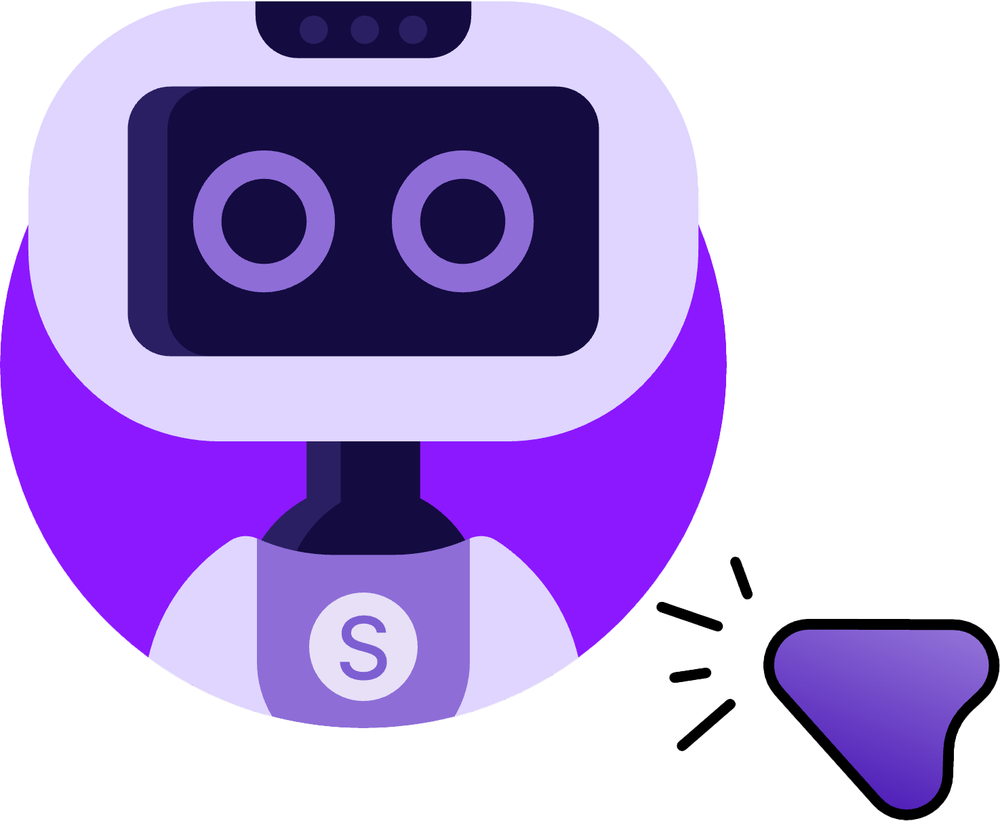

<h1 align="center">
   Turing
</h1>

<h3 align="center">
  Your Desktop on Autopilot, Saves you Hundreds of Hours
</h3>

## 💡 What's This About?

Think about all the hours you've wasted on your computer. Not the fun stuff—the soul-crushing, repetitive tasks. Answering that same support ticket for the fiftieth time. Formatting spreadsheets. Clicking through the same sequence of menus you could do with your eyes closed.

Steve Jobs had this vision back in the 1980s. He said computers should be like bicycles for the mind—natural extensions of ourselves. And more than that, he imagined computers that could anticipate what you wanted to do next. They'd just... know.

Well, it's been over forty years, and we're still clicking and typing like it's 1984.

Turing changes that. Instead of you serving your computer, your computer learns how *you* work. It watches (only when you tell it to), learns your patterns, remembers your workflows, and then—here's the good part—it can actually do them for you. While you're out grabbing lunch with friends or finally getting to that book you've been meaning to read.

And yeah, you can just talk to it. "Hey Jarvis, open Spotify and play my workout playlist." Done. No hands required.

## ✨ What It Does

Here's the thing. Most desktop automation tools are blind. They click at coordinates (543, 210) and hope that button's still there. Turing's different—it actually *sees* your screen, understands what's happening, and adapts when things move around.

### 🎬 Recording & Learning

You can record any workflow you do regularly. Open your email client. Reply to a message. File it in a specific folder. Whatever your routine is.

Turing records the video, captures every click and keystroke (timestamps and all), then sends it to a Vision Language Model that understands what you were trying to accomplish. Not just "clicked at x, y" but "clicked the Submit button to send the form." Semantic understanding, if you want to get technical about it.

These workflows get stored in a vector database—think of it like a library where similar tasks sit near each other. When you ask Turing to do something later, it searches for workflows that match and executes them. But smarter. It adapts to your screen, your apps, your way of doing things.

### 🎤 Voice Control

Wake word detection means you can say "Hey Jarvis" and Turing starts listening. Then just tell it what you need. The transcription uses Wispr Flow for high-quality speech-to-text, and there's this neat transparent overlay that shows you what it heard. Live transcription as you speak, actually.

Voice Activity Detection figures out when you've stopped talking. You don't need to press any buttons or say "stop recording" like some assistant from 2015. It just knows.

### 🤖 Desktop Automation That Actually Works

Under the hood, Turing uses Vision Language Models (Gemini 2.5 Flash, if you're curious) for screen understanding. It can see buttons, text fields, menus—all the UI elements you interact with. Then it uses specialized grounding models to translate that understanding into actual actions your computer can execute.

It's not just about clicking buttons, though. Turing can run code locally when that makes more sense. Data processing tasks, file manipulation, system automation—sometimes Python or Bash is faster and more reliable than simulating GUI interactions.

## 🛠️ Getting Started

### Installation

Dead simple if you just want to use it:

```bash
pip install gui-agents
```

If you're the tinkering type and want to modify things:

```bash
git clone https://github.com/simular-ai/Agent-S.git
cd Agent-S
pip install -e .
```

One more thing—you need Tesseract for OCR:

```bash
brew install tesseract  # macOS
# or
apt-get install tesseract-ocr  # Linux
# or
choco install tesseract  # Windows
```

### Configuration

You've got two options here. Either set environment variables (the clean way):

```bash
# Add these to your .bashrc or .zshrc
export OPENROUTER_API_KEY=<your_key>
export OPENAI_API_KEY=<your_key>
export ANTHROPIC_API_KEY=<your_key>
export WISPR_API_KEY=<your_key>  # for voice
export ELEVENLABS_API_KEY=<your_key>  # for voice
```

Or do it in Python (the quick way):

```python
import os
os.environ["OPENROUTER_API_KEY"] = "<your_key>"
```

Get your OpenRouter key at https://openrouter.ai/. They've got free models like Gemini 2.0 Flash if you want to try out Agent_S3.

## 🚀 Usage

### Basic Desktop Automation

The simplest way to run Turing is through the command line. This uses OpenAI's GPT-4o for vision (it needs to see your screen) and Cerebras for fast text-only reflection:

```bash
agent_s \
    --provider openai \
    --model gpt-4o \
    --reflection_provider cerebras \
    --reflection_model qwen-3-32b \
    --ground_provider huggingface \
    --ground_url http://localhost:8080 \
    --ground_model ui-tars-1.5-7b \
    --grounding_width 1920 \
    --grounding_height 1080
```

Or if you want to use the free Gemini model through OpenRouter:

```bash
agent_s \
    --provider open_router \
    --model google/gemini-2.0-flash-exp:free \
    --model_url https://openrouter.ai/api/v1 \
    --ground_provider huggingface \
    --ground_url http://localhost:8080 \
    --ground_model ui-tars-1.5-7b \
    --grounding_width 1920 \
    --grounding_height 1080
```

The grounding model is what translates "click the submit button" into actual coordinates. UI-TARS is pretty good at this. You'll need to host it somewhere—HuggingFace Inference Endpoints work well.

### Recording Your Workflows

This is where it gets interesting. You can teach Turing new skills by just showing it what to do.

**Using the CLI (easiest):**

```bash
# Start recording - when you stop (Ctrl+C), it automatically analyzes and indexes the skill
agent_s record start --name "reply_to_email"

# List your recordings
agent_s record list

# Manually process a specific recording
agent_s record process ~/Documents/AgentS_Recordings/my_recording/
```

**Using the Python API:**

```python
from gui_agents.s3.recording import Recorder

# Create recorder (video mode by default)
recorder = Recorder(recording_name="reply_to_email")

# Start recording
recorder.start()

# Do your workflow... Turing's watching
# (Open email, read it, type reply, click send, whatever)

# Stop when done
recording_path = recorder.stop()
print(f"Saved to: {recording_path}")
```

After you stop recording, the post-processing pipeline kicks in. It converts your mouse/keyboard events to readable actions, sends the video to a VLM (Vision Language Model) for analysis, and creates a structured workflow that goes into the vector database.

Want to use screenshot mode instead of video? Lighter on disk space:

```bash
agent_s record start --name "my_workflow" --mode screenshots
```

Or with Python:

```python
recorder = Recorder(
    recording_name="my_workflow",
    mode="screenshots"  # captures on clicks, hotkeys, scroll stops
)
```

Then process the recording (if you used `--no-process` or want to reprocess):

```bash
agent_s record process
```

Or with Python:

```python
from gui_agents.s3.recording.post_recording import process_recording

results = process_recording(recording_path)

if results["success"]:
    print(f"Created skill: {results['skill_id']}")
else:
    print(f"Errors: {results['errors']}")
```

Now that workflow's in the database. Next time you ask Turing to do something similar, it'll find this workflow and execute it. Personalized automation without writing a single line of code.

### Voice Control

Run the voice assistant:

```bash
agent_s voice start
```

Say "Hey Jarvis" to activate. A transparent overlay appears—it shows what it hears in real-time. Just speak naturally. Tell it what you need.

The voice system uses Wispr Flow for transcription (really high quality, understands context), wake word detection for the trigger. All the audio processing happens locally except the transcription part.

You can list your audio devices if it's picking up the wrong microphone:

```bash
agent_s voice list-devices
```

Then specify which one to use:

```bash
agent_s voice start --device 2
```

### Using Turing in Your Code

If you want more control, you can use Turing as a library:

```python
import pyautogui
import io
from gui_agents.s3.agents.agent_s import AgentS3
from gui_agents.s3.agents.grounding import OSWorldACI

# Configuration
engine_params = {
    "engine_type": "openai",
    "model": "gpt-4o"
}

grounding_engine_params = {
    "engine_type": "huggingface",
    "model": "ui-tars-1.5-7b",
    "base_url": "http://localhost:8080",
    "grounding_width": 1920,
    "grounding_height": 1080
}

# Create the grounding agent
grounding_agent = OSWorldACI(
    platform="darwin",  # or "windows" or "linux"
    engine_params_for_generation=engine_params,
    engine_params_for_grounding=grounding_engine_params
)

# Create the main agent
agent = AgentS3(
    engine_params,
    grounding_agent,
    platform="darwin",
    max_trajectory_length=8,
    enable_reflection=True
)

# Take a screenshot
screenshot = pyautogui.screenshot()
buffered = io.BytesIO()
screenshot.save(buffered, format="PNG")
screenshot_bytes = buffered.getvalue()

# Ask Turing to do something
instruction = "Open Chrome and navigate to GitHub"
info, action = agent.predict(
    instruction=instruction,
    observation={"screenshot": screenshot_bytes}
)

# Execute the action
exec(action[0])
```

Pretty straightforward. Take a screenshot, ask Turing what to do, execute the code it generates.

### Searching Your Recorded Workflows

Once you've recorded some workflows, you can search through them:

**Using the CLI:**

```bash
# Search for skills
agent_s skills search "resize images"

# List all indexed skills
agent_s skills list

# Generate a plan from your skills
agent_s skills compose "download an image and resize it to 800x600"
```

**Using the Python API:**

```python
from gui_agents.s3.skills import SkillStore, SkillRetriever

# Load the skill store
store = SkillStore()
retriever = SkillRetriever(store)

# Search for workflows
results = retriever.retrieve(
    query="how do I resize images in GIMP",
    n_results=3
)

for result in results:
    print(f"{result.skill.name} (score: {result.score:.2f})")
    print(f"  {result.skill.summary}")
```

The search combines semantic similarity (understanding what you mean) with keyword matching (finding exact terms). So whether you search for "resize photo" or "make image smaller," it'll find the right workflow.

## 🔧 Advanced Features

### Local Coding Environment

Sometimes GUI automation is the wrong tool. If you need to process 1000 CSV files or refactor code, Turing can drop into a local coding environment:

```bash
agent_s \
    --provider openai \
    --model gpt-4o \
    --ground_provider huggingface \
    --ground_url http://localhost:8080 \
    --ground_model ui-tars-1.5-7b \
    --grounding_width 1920 \
    --grounding_height 1080 \
    --enable_local_env  # This enables code execution
```

Now when you ask Turing to manipulate data or work with files, it can write and execute Python or Bash scripts directly. Way faster than clicking through a GUI, and honestly more reliable for these kinds of tasks.

Just remember—this executes arbitrary code with your user permissions. Only enable it if you understand what that means.

### Workflow Chaining

The really cool thing about storing workflows semantically is you can chain them together. Turing understands preconditions and postconditions.

For example, if you have:
1. A workflow that downloads a file (postcondition: "file downloaded")
2. A workflow that processes CSV files (precondition: "CSV file exists")

Turing can automatically chain them. "Download this CSV and process it" becomes two workflows executed in sequence.

```python
from gui_agents.s3.skills import SkillStore

store = SkillStore()

# Find a workflow
skill = store.get_skill("download_csv_workflow")

# Find what can come after
chainable = store.find_chainable_skills(skill)

for next_skill in chainable:
    print(f"Can chain: {next_skill.name}")
```

We're working on making this more automatic. Eventually you should be able to describe a complex multi-step goal and Turing will figure out the workflow chain itself.

## 🎯 What Makes This Different

Look, there are a lot of automation tools out there. Most of them are either:
- Brittle (breaks when your screen resolution changes)
- Blind (no understanding of what's actually on screen)
- Manual (you have to program every single step)

Turing combines vision, learning, and adaptability. It sees what you see. It learns what you do. And it adapts when things change.

The recording feature means you don't need to be a programmer. Show it once, and it figures out the pattern. The voice control means you don't even need to type. And the semantic storage means asking for "email reports" will find your "send weekly analytics email" workflow even though you didn't use those exact words.

It's closer to having a really observant assistant who pays attention and remembers things. Which, let's be honest, is what we've wanted computers to be for decades.

## 🐛 Known Issues

Real talk—this is complex software. Here are some things to know:

- Multi-monitor setups aren't fully supported yet. Use your primary monitor.
- Grounding models sometimes struggle with very cluttered interfaces. Clean UIs work better.
- Voice wake word detection can be finicky depending on your microphone. Try the device selection if it's not working.
- Recording very long workflows (30+ minutes) can create large video files. Consider using screenshot mode.
- The first time you record and analyze a workflow, it takes a minute. Be patient. VLMs are doing a lot of work.

Found a bug? Open an issue on GitHub or hit us up in Discord.

## 🤝 Contributing

We'd love help making Turing better. A few areas where we need expertise:

- Pre-recorded workflows for common software (give everyone a head start)
- Better grounding models (UI element detection is hard)
- Cloud execution (run workflows on your computer from your phone)
- Workflow composition UI (visual way to chain workflows)

Check out the issues on GitHub. Or just fork it and build something cool.

---

<div align="center">
Built with the belief that computers should work for us, not the other way around.
</div>
